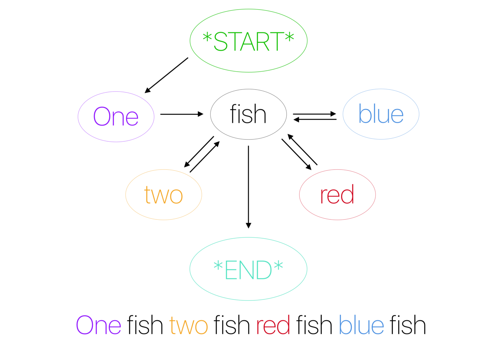

# Markov Text Generator

Quickly generate text based on a sample of text provided. The produced text will make no logical sense except
for a few occasions. This type of text generation is based of a Markov model/process whereby the program 
decides the next word using statistics of each preceding word found in the text. 

The Markov model used in this program uses a 2-word prefix (bi-gram) linked to a 1 word suffix 
e.g. "Hello my name is." -> {["Hello", "my"] : "name", ["my", "name"]: "is"...}.

The image below shows text produced after genearting a model on the 4th Harry Potter book.

## How to Use

The executable can be downloaded from the [Releases](https://github.com/akapila011/Markov-Text-Generator/releases/) page of this repository.
Ensure your system has the .Net platform available to run this software. This especially affects Linux users.

To use the software you first run the executable. Once the window has loaded you can select a text file to create a model.
This text file must have .txt file extension. Please ensure that the text uses fullstops('.') to seperate sentences and spaces(" ") to seperate words for best results.
**There are sample text file that can be [downloaded](https://github.com/akapila011/Markov-Text-Generator/tree/master/text%20files) from this repository.**

Once you have selected the text file, you simply have to click the 'Train' button and you will be notified once the the model has been generated.

Finally, select the number of words you want generated and click the 'Generate Text' button to get some computer generated sentences.

## Algorithm

The text generation has a training phase and a execution phase.

#### Training
1. Take text from the text file and break it into a list of words using a space character as the delimiter.
2. For every 3 words, use the first 2 words as a key to a list and put the the third word in the list linked to the key.

This creates the model which is actually just a Dictionary where each key consists of 2 words to a value consisting of words that follow the first 2 words.

#### Execution
1. Choose a random key from the model (dictionary) and add to the sentence being generated
2. Loop from index 1 to the text length specified. For every iteration:
 2.1. Get the last 2 words from the generated sentence
 2.2 Find the key with the last 2 words and then randomly select a word from the list associated with this key. If no key exists choose a new rnadom key and add to the sentence

### TODO:
* Allow for selecting generated text.
* Expand number of words produced.
* Fix layout for resizing

